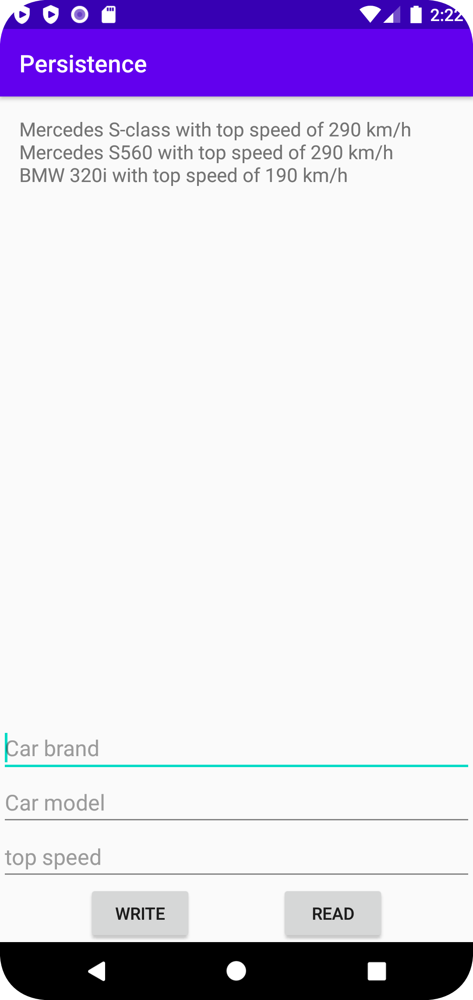

# Rapport

Forked the project and did a test commit to see if the correct account is connected to github.
Then I added layout for the MainActivity and added the database class. I structured the DatabaseTable and added DatabaseHelper
The DatabaseTable is structured with the correct number of rows and data type.
Then I added functionality in the DatabaseHelper so the table is created when the database version changes (onUpgrade). Also added SQL_DELETE_TABLE_CARS in the DatabaseTable class.
In the MainActivity I findViewById on all the EditText needed and did addCars method. In this commit you can see that topspeed = findViewById(R.id.car_model) instead of findViewById(R.id.topspeed).
This issue took some time to find out and it was due to copy paste.
Next commit I changed it to the correct EditText and added autoincrement on the ID and changed the int to integer in topspeed. Now you can add cars into the database.

Then I created the Cars class for each car with the correct variables: id, brand, model, topspeed and added the getters for the variables.
To fetch the rows from the database I created an ArrayList<Car> and fetched it with Cursor. Cursor creates a new car with the values from the rows in the database.

Removed the textViews in MainActivity because the assignment says the data should append into the TextViews.

```Java
//The cars table
"CREATE TABLE " + Cars.TABLE_NAME + " (" +
                        Cars.COLUMN_NAME_ID + "INTEGER PRIMARY KEY," +
                        Cars.COLUMN_NAME_ID + " INTEGER PRIMARY KEY AUTOINCREMENT NOT NULL," +
                        Cars.COLUMN_NAME_BRAND + " TEXT," +
                        Cars.COLUMN_NAME_MODEL + " TEXT," +
                        Cars.COLUMN_NAME_TOPSPEED + " INT)";
                        Cars.COLUMN_NAME_TOPSPEED + " INTEGER)";


//MainActivity, add cars
addCars(brand.getText().toString(), model.getText().toString(), Integer.parseInt(topspeed.getText().toString()));


//addCars method
private long addCars(String brand, String model, int topspeed){
        values.put(DatabaseTables.Cars.COLUMN_NAME_BRAND, brand);
        values.put(DatabaseTables.Cars.COLUMN_NAME_MODEL, model);
        values.put(DatabaseTables.Cars.COLUMN_NAME_TOPSPEED, topspeed);
        System.out.print(values);
        return database.insert(DatabaseTables.Cars.TABLE_NAME, null, values);
    }

//getCar from getFields is clicked
getFields.setOnClickListener(new View.OnClickListener() {
            @Override
            public void onClick(View view) {
                carsList = getCars();
                for (Car car: carsList) {
                    carView.append(car.getCarBrand() + " " + car.getCarModel() + " with top speed of " + car.getTopspeedString() + " km/h \n");
                }
            }
        });

//Fetch car
private ArrayList<Car> getCars() {
        Cursor cursor = database.query(DatabaseTables.Cars.TABLE_NAME, null, null, null,null,null,null);
        ArrayList<Car> cars = new ArrayList<>();
        while (cursor.moveToNext()) {
            Car car = new Car(
                    cursor.getLong(cursor.getColumnIndexOrThrow(DatabaseTables.Cars.COLUMN_NAME_ID)),
                    cursor.getString(cursor.getColumnIndexOrThrow(DatabaseTables.Cars.COLUMN_NAME_BRAND)),
                    cursor.getString(cursor.getColumnIndexOrThrow(DatabaseTables.Cars.COLUMN_NAME_MODEL)),
                    cursor.getInt(cursor.getColumnIndexOrThrow(DatabaseTables.Cars.COLUMN_NAME_TOPSPEED))
            );
            cars.add(car);
        }
        cursor.close();
        return cars;
    }

```



